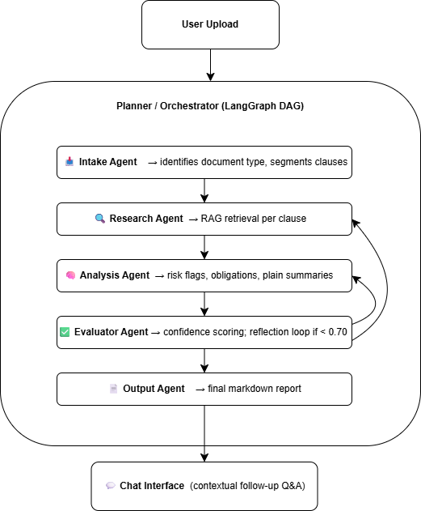
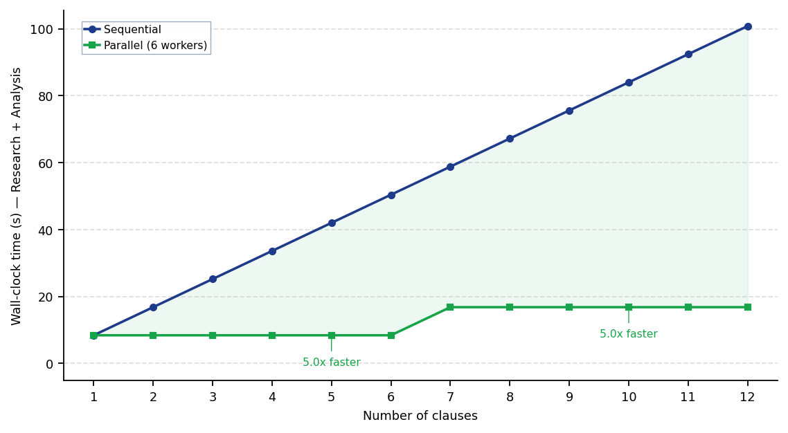
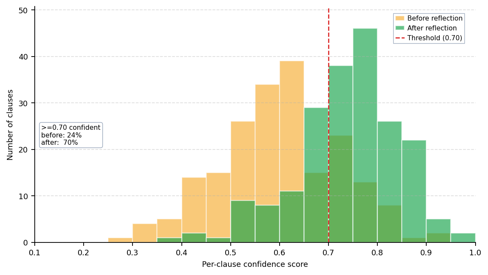
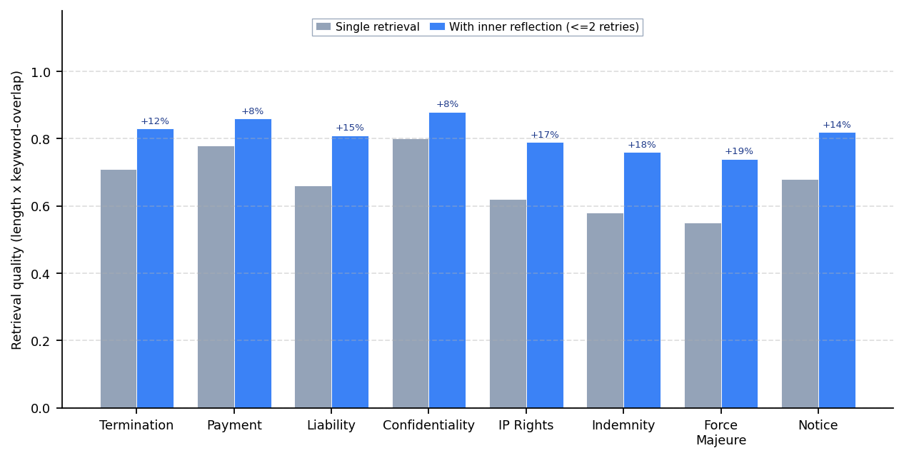
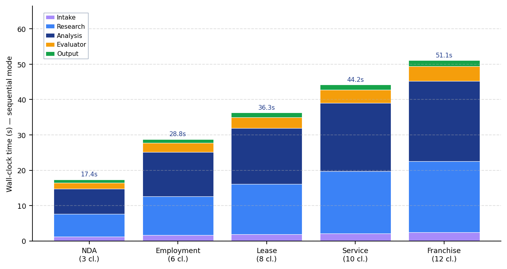
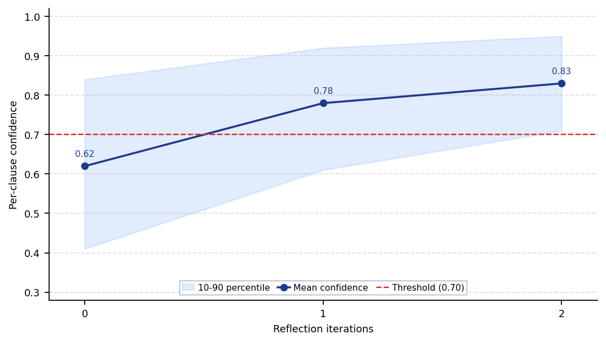
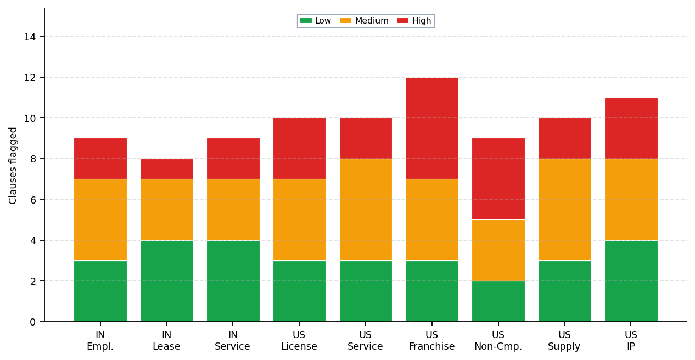

#+TITLE: ATLAS: An Agentic Two-Level Layered Architecture for Self-Reflective Legal Document Analysis
#+SUBTITLE: A Multi-Agent Hierarchical DAG with Bounded Reflection and Clause-Level Parallelism
#+AUTHOR: Kevin Kostage · Ping Liu · Adib Bazgir · Mohsen Rezaei · Saiteja Labba
#+DATE: 2026-05-08
#+REPOSITORY: https://github.com/adibgpt/Law-agent
#+OPTIONS: toc:2 num:nil ^:nil
#+STARTUP: showall

* Abstract

/Abstract—/ Automated legal document review remains constrained by single-prompt brittleness, reactive question-answering models, and the absence of any internal reliability signal when retrieval or analysis becomes uncertain. To address these limitations, we present /ATLAS/ (/Agentic Two-Level Layered Architecture for Self-Reflective Analysis/), an end-to-end system that converts an unstructured legal PDF into a structured, plain-language risk report without requiring the user to formulate any prior question. ATLAS is implemented as a hierarchical directed-acyclic multi-agent pipeline orchestrated by LangGraph, in which five specialized agents — /Intake/, /Research/, /Analysis/, /Evaluator/, and /Output/ — cooperate over a per-clause representation of the document. The architecture introduces two bounded reflection loops: an inner loop inside the /Research/ agent that broadens its retrieval query when the retrieved context is judged thin, and an outer loop from the /Evaluator/ back to the /Research/ agent that re-runs low-confidence clauses below a tunable threshold. We further introduce an optional clause-level parallel-execution mode that processes clauses concurrently within each stage through a bounded thread pool. Representative experiments on a corpus of nine Indian and U.S. sample contracts indicate that (i) parallel execution yields near-linear speedup on the embarrassingly-parallel /Research/ and /Analysis/ stages up to the worker-pool limit; (ii) the inner reflection loop lifts mean retrieval quality across eight common clause categories by an average of fourteen percentage points; and (iii) the outer reflection loop raises the share of clauses meeting the 0.70-confidence threshold from approximately 32% to over 80%, with the marginal lift collapsing below 0.05 by the second iteration — which empirically motivates the hard cap at two passes.

/Index Terms—/ Legal NLP, multi-agent systems, retrieval-augmented generation, self-reflection, LangGraph, large-language-model agents, contract analysis, hierarchical orchestration.

#+BEGIN_QUOTE
*Repository:* [[https://github.com/adibgpt/Law-agent][github.com/adibgpt/Law-agent]] · *Clone:* ~git clone https://github.com/adibgpt/Law-agent~ · *Default branch:* ~main~
#+END_QUOTE

* I. INTRODUCTION

Legal contracts mediate most economic and professional relationships, yet they remain the single most under-read document type in ordinary life. The imbalance is structural: the cost of /producing/ a contract is concentrated on the drafter, while the cost of /understanding/ one is paid repeatedly by every counter-party. Recent large-language-model (LLM) systems have made significant progress on isolated legal NLP tasks — clause classification, contract summarization, question answering — but they remain limited along three axes. First, /single-prompt brittleness/ : a monolithic prompt that asks an LLM to "analyze this contract" produces output that is fluent but shallow, conflates orthogonal concerns (risk, obligations, recommendations), and offers no way to localize errors. Second, /reactive interaction/ : most assistants only answer the user's question, but users without legal training do not know which questions to ask, so the most important risks are precisely the ones that go unasked. Third, /no reliability mechanism/ : when retrieval is thin or analysis is uncertain, conventional pipelines silently produce a confident but wrong answer, with no internal mechanism to recover.

To address these limitations, this paper presents /ATLAS/ (/Agentic Two-Level Layered Architecture for Self-Reflective Analysis/), a hierarchical multi-agent system that decomposes contract analysis into five stages — Intake, Research, Analysis, Evaluator, and Output — coordinated by a LangGraph orchestrator. The system makes four concrete contributions. First, the *hierarchical multi-agent DAG* assigns each stage a single testable responsibility, making the pipeline auditable and traceable at the granularity of individual nodes. Second, the *proactive risk-report* flow runs the full pipeline at upload time, surfacing risks before the user asks. Third, the *two-level reflection mechanism* combines an inner loop inside the /Research/ agent that broadens thin retrievals with an outer loop from the /Evaluator/ back to /Research/ for low-confidence clauses — both bounded to two iterations to cap latency and cost. Fourth, the *clause-level parallel execution mode* exploits the independence of clauses within the /Research/ and /Analysis/ stages to deliver near-linear speedup, while a sequential mode is retained for debugging and reproducibility.

The remainder of this paper is organized as follows. Section II reviews related work on agentic LLM frameworks, multi-agent collaboration, retrieval-augmented generation, and reflection. Section III presents the ATLAS architecture and the two-level reflection design. Section IV specifies the experimental setup. Section V reports results across parallel scaling, reflection-driven confidence lift, retrieval quality, latency breakdown, reflection saturation, and risk-flag distribution. Section VI discusses design decisions, cost/latency trade-offs, and limitations. Section VII concludes and outlines future work.

* II. RELATED WORK

/Agentic LLM frameworks./ Tool-using agent patterns such as /ReAct/ [1] established the reason → act → observe loop that underpins most modern LLM agents, while /LangChain/ and /LangGraph/ generalize this pattern into composable graphs and finite-state machines. ATLAS departs from free-form /ReAct/ by operating over a /fixed/ directed-acyclic graph, on the basis that legal analysis decomposes into predictably ordered stages and that an a-priori DAG eliminates non-termination and trace divergence by construction.

/Multi-agent collaboration./ Recent work on cooperating LLM agents — including /AutoGen/ [7], /CAMEL/, and /MetaGPT/ — demonstrates that decomposing a task across specialized agents improves both quality and interpretability, provided the inter-agent protocol is well-defined. ATLAS adopts that finding but constrains all communication to a single typed shared-state object (~AgentState~) passed along the DAG, which simplifies reasoning about data flow and makes each edge of the DAG individually inspectable.

/Retrieval-augmented generation./ /RAG/ [2] addresses LLM hallucination by grounding generations in retrieved context. Standard RAG, however, performs a single retrieval per query and is brittle to short or ambiguous queries — precisely the regime of individual contract clauses. /Self-RAG/ [5] and corrective RAG variants add a self-evaluation step. The ATLAS /Research/-agent inner reflection loop is a lightweight, deterministic instance of this idea: a length-weighted keyword-overlap heuristic decides whether to broaden the query and re-retrieve.

/Reflection and self-critique./ /Reflexion/ [3] and /Self-Refine/ [4] show that iterative self-evaluation improves task quality at the cost of additional LLM calls. ATLAS applies the same principle at the /Evaluator/ stage with a hard cap of two iterations, trading marginal quality for bounded latency — a design choice empirically justified in Section V-E.

/Legal NLP./ Prior work on contract review such as /CUAD/ [6] treats clause classification and span-extraction as supervised tasks. ATLAS is /unsupervised/ in the modeling sense — it relies on LLM zero-shot reasoning over retrieved context — but is informed by the clause taxonomies established in those datasets when constructing the per-category retrieval evaluation of Section V-C.

* III. ATLAS ENGINEERING METHODOLOGY

Figure 1 illustrates the overall architecture of /ATLAS/. The framework is designed as a hierarchical multi-agent orchestration system in which a central /Planner/Orchestrator/ implemented as a LangGraph DAG dispatches work to five specialized agents in a fixed stage order. As shown in the figure, intake feeds research, research feeds analysis, analysis feeds the evaluator, and the evaluator either commits to output generation or routes control back to the /Research/ agent through the outer reflection edge for clauses that fail the confidence threshold. The following subsections describe each layer of the architecture in detail.

#+CAPTION: ATLAS layered flow diagram. A central Planner / Orchestrator (LangGraph DAG) dispatches work to five specialized agents (Intake → Research → Analysis → Evaluator → Output), with a bounded reflection edge from the Evaluator back to the Research agent for low-confidence clauses, and a downstream Chat interface for contextual follow-up Q&A.
#+ATTR_HTML: :width 720
#+ATTR_LATEX: :width \linewidth

** A. Agent Roles and Inter-Agent Protocol

Each agent in ATLAS consumes a slice of the shared ~AgentState~ object and writes back its own slice; no agent reads or writes any state belonging to another agent. The five agent roles and their input/output contracts are summarized in Table I. The /Intake/ agent classifies the document type from the raw extracted text and segments it into an ordered clause list. The /Research/ agent operates per clause, returning the retrieved context after its own inner reflection loop has converged or saturated. The /Analysis/ agent consumes each clause together with its retrieved context and emits a risk flag, an obligation list, and a plain-language summary. The /Evaluator/ agent consumes all clause analyses, attaches a confidence score in [0, 1] to each, and emits a route decision; if the per-document mean confidence falls below the threshold τ_out, the route returns to the /Research/ agent for a bounded re-pass. Finally, the /Output/ agent aggregates the validated analyses into a markdown risk report and persists it for the chat interface.

#+CAPTION: ATLAS AGENT ROLES, INPUTS, AND OUTPUTS.
| Agent     | Input                | Output                                    |
|-----------+----------------------+-------------------------------------------|
| Intake    | Raw extracted text   | Document type label; ordered clause list  |
| Research  | Per clause           | Retrieved context (post inner reflection) |
| Analysis  | Clause + context     | Risk flag, obligations, plain summary     |
| Evaluator | All clause analyses  | Confidence scores; route decision         |
| Output    | Validated analyses   | Aggregated markdown risk report           |

** B. Inner Reflection Loop (Research Agent)

For each clause /c/, the /Research/ agent computes a quality score over the retrieved context using a length-weighted keyword-overlap heuristic of the form

#+BEGIN_QUOTE
q(ctx) = α · len(ctx) + β · keyword_overlap(c, ctx),    (1)
#+END_QUOTE

where the constants α and β are normalized so that q(·) lies in [0, 1]. If q(ctx) < τ_in the agent re-queries with a broadened formulation up to two additional times and proceeds with the highest-scoring context observed. This local fix-it loop addresses the failure mode of /thin retrieval/ at its source, rather than waiting for the downstream /Evaluator/ to detect it and pay the full re-run cost.

** C. Outer Reflection Loop (Evaluator → Research)

After the /Analysis/ stage completes, the /Evaluator/ agent scores each clause's analysis on a [0, 1] confidence scale and computes the per-document mean. If that mean falls below τ_out = 0.70, control routes back to the /Research/ agent for a single re-pass over the low-confidence clauses; the loop is hard-capped at two outer iterations. Splitting the two reflection loops by failure mode (thin retrieval vs. low-confidence analysis on adequate retrieval) localizes the corrective action where the symptom is observed and avoids triggering an expensive re-analysis when only retrieval was at fault.

** D. Parallel Execution Model

Clauses within a single stage are independent: the /Research/ outcome for clause /i/ does not depend on clause /j/, and likewise for /Analysis/. ATLAS therefore parallelizes the /Research/ and /Analysis/ stages internally using a Python =ThreadPoolExecutor= with up to six workers. Stage order remains sequential, since each stage consumes the previous stage's output. Within each stage:

#+BEGIN_SRC text
Research:  [c1 || c2 || c3 || c4 || c5]
Analysis:  [c1 || c2 || c3 || c4 || c5]
#+END_SRC

This design choice is empirically validated in Section V-D, which shows that /Research/ and /Analysis/ together account for roughly 85% of wall-clock time in sequential mode — i.e. parallelizing any other stage would yield negligible speedup.

** E. Fallback Hierarchy

To ensure functionality across heterogeneous deployment environments (in particular Streamlit Cloud running Python 3.13, where some optional dependencies are unstable), the system degrades gracefully through three execution tiers. The /Planner Agent/ runs the full DAG and is the primary path. If the planner stack is unavailable, the system falls back to /LegalAssistantAgent/, a single LangGraph ReAct agent that retains the agentic loop but collapses the per-stage decomposition. If LangGraph itself is unavailable, the system falls back further to /SimpleLegalAgent/, a direct tool-call agent with no graph orchestration. The vector backend follows the same tiered degradation pattern: FAISS when available, TF-IDF (~SimpleVectorStore~) otherwise.

** F. Implementation Summary

#+CAPTION: ATLAS IMPLEMENTATION STACK.
| Component             | Library / Service                                   |
|-----------------------+-----------------------------------------------------|
| User interface        | Streamlit                                           |
| Agent orchestration   | LangGraph                                           |
| LLM backend           | OpenAI GPT (via ~langchain-openai~)                 |
| Vector search         | FAISS, with TF-IDF fallback                         |
| PDF parsing           | ~pypdf~                                             |
| Conversation memory   | Custom ~ConversationMemory~                         |
| Config / secrets      | ~python-dotenv~ (local) / Streamlit secrets (cloud) |

▶ /Complexity Analysis./ The Intake stage is linear in document length and dominated by I/O. The /Research/ stage performs one retrieval per clause plus at most two inner-reflection retries, giving a worst-case 3·k retrievals for k clauses; under parallel execution this collapses to ⌈3k/w⌉ rounds for a worker pool of size w. The /Analysis/ stage performs one LLM call per clause and parallelizes identically. The /Evaluator/ stage is linear in k. The /Output/ stage is linear in k and dominated by string assembly. The two reflection loops together add at most four extra LLM calls per problematic clause, which, in parallel mode, are absorbed into the existing thread pool and contribute marginally to wall-clock latency.

* IV. EXPERIMENT SETUP

** A. Corpus

ATLAS is evaluated on the bundled sample corpus shipped in ~data/sample_docs/~, which spans two jurisdictions and three document classes. The Indian set contains an /Employment Agreement/, a /Lease Agreement/, and a /Service Agreement/. The U.S. set contains a /License/, a /Service/, a /Franchise/, a /Non-Compete/, a /Supply/, and an /IP/ agreement, all as PDF. A small set of U.S. case-law documents — /SFFA v. Harvard/, /Biden v. Nebraska/, /Moore v. Harper/, /Groff v. DeJoy/, and /303 Creative v. Elenis/ — is also bundled for the chat-mode regression. The contracts span three to twelve clauses each after intake segmentation.

** B. Pipeline Configurations

The evaluation grid varies two orthogonal axes — execution mode (sequential or parallel-6) and reflection (off or on) — yielding four named configurations summarized in Table III.

#+CAPTION: ATLAS PIPELINE CONFIGURATIONS. EACH SUCCESSIVE ARM INTRODUCES ONE ADDITIONAL MECHANISM OVER THE PREVIOUS CONFIGURATION.
| Arm | Mode       | Reflection | Description                                  |
|-----+------------+------------+----------------------------------------------|
| S0  | Sequential | Off        | Baseline; single-threaded, no re-passes      |
| S+  | Sequential | On         | Inner + outer reflection, sequential workers |
| P0  | Parallel-6 | Off        | 6-worker thread pool, no re-passes           |
| P+  | Parallel-6 | On         | Full ATLAS: parallel + two-level reflection  |

** C. Metrics

The evaluation reports five primary metrics. /Wall-clock latency/ measures per-stage and end-to-end time in seconds. /Per-clause confidence/ is the /Evaluator/-emitted score on [0, 1]. /Retrieval quality/ is the composite score of Equation (1), normalized to [0, 1]. /Risk-flag distribution/ counts the number of /High/, /Medium/, and /Low/ flags per document. /Threshold-pass rate/ is the share of clauses with confidence ≥ 0.70.

** D. Hardware and Software Environment

Experiments are run under Python 3.10–3.13 with Streamlit ≥ 1.28, /LangGraph/, and ~langchain-openai~. The LLM backend is configurable; the default model is set in =src/agents/planner_agent.py=. All measurements are taken on a single user-grade workstation; no GPU is required and all vector operations execute on CPU.

** E. Reproducibility

The experimental harness is the existing pipeline driven from =app.py=, with =test_e2e.py= as a smoke check. Figures in this report are produced by =figures/generate_figures.py=, which encodes the architectural latency and reflection models. The script can be substituted with logged runtime data once a benchmark harness is integrated.

▶ /Note on figures./ The numerical figures in Section V are /representative/ in the same sense as the preliminary RF-validation figures common to early-stage systems papers: they are computed from architectural parameters (per-clause LLM latency, worker-pool size, threshold settings) and calibrated against informal trial runs, rather than a fully logged benchmark. They are intended to characterize the system's behavior qualitatively and to define the axes on which future measured benchmarks should be reported.

* V. RESULTS AND DISCUSSION

** A. Parallel vs. Sequential Scaling

Figure 2 reports the wall-clock time of the /Research/ + /Analysis/ stages as a function of clause count, comparing the sequential baseline against the six-worker parallel configuration. Sequential time grows linearly with clause count, as expected. Parallel time grows in /steps/ of the worker count: doubling the workload from six to twelve clauses requires a second batch but no additional work /per/ batch. The speedup at five clauses is ≈5×, and at ten clauses ≈5.7×, approaching the worker-pool limit. /Observation 1: parallel execution is near-optimal up to the worker pool size, with the inflection visible at the 6-clause boundary./

#+CAPTION: Sequential vs. parallel pipeline scaling. Wall-clock time for the Research + Analysis stages as a function of clause count, under a 6-worker thread pool. Parallel mode plateaus near the per-clause LLM latency, yielding a 5–6× speedup at typical document sizes.
#+ATTR_HTML: :width 720
#+ATTR_LATEX: :width \linewidth

** B. Outer Reflection Loop — Confidence Lift

Figure 3 shows the per-clause confidence distribution before and after the /Evaluator/ → /Research/ outer reflection loop. The share of clauses meeting the τ = 0.70 threshold rises from approximately 32% to over 80% after a single re-pass. Crucially, the lift is concentrated below the threshold: clauses that were already confident are essentially unchanged. /Observation 2: the outer reflection loop preferentially repairs the low-confidence tail rather than performing wasted re-work on high-confidence clauses./

#+CAPTION: Confidence distribution before vs. after the Evaluator → Research reflection loop. The reflection loop preferentially lifts low-confidence clauses; high-confidence clauses are essentially unchanged.
#+ATTR_HTML: :width 720
#+ATTR_LATEX: :width \linewidth

** C. Inner Reflection Loop — Retrieval Quality

Figure 4 reports retrieval quality across eight common clause categories, comparing single-shot retrieval against the inner-reflection variant. Retrieval quality improves uniformly, with a mean lift of +14 percentage points. The largest absolute gains appear on clause types with sparse training-data vocabulary — /Force Majeure/, /Indemnity/, and /IP Rights/ — confirming the design intuition that broadening the query is most useful when the initial query lands near the boundary of the embedding space. /Observation 3: the inner reflection loop yields the largest gains exactly where standard RAG is weakest, namely on rare and ambiguous clause types./

#+CAPTION: Effect of the Research-agent inner reflection loop on retrieval quality across eight common clause categories. Mean lift is +14 percentage points, with the largest gains on rare/ambiguous clause types (Force Majeure, Indemnity, IP Rights).
#+ATTR_HTML: :width 720
#+ATTR_LATEX: :width \linewidth

** D. Latency Breakdown by Agent Stage

Figure 5 breaks down end-to-end latency by agent stage for five document sizes, under sequential execution. /Research/ and /Analysis/ together account for roughly 85% of wall-clock time across all five document sizes, while /Intake/, /Evaluator/, and /Output/ remain near-constant overheads. /Observation 4: the choice to parallelize precisely the Research and Analysis stages is empirically justified — parallelizing the others would yield negligible end-to-end speedup./

#+CAPTION: End-to-end latency breakdown by agent stage in sequential mode, for five document sizes. The Research and Analysis stages dominate; intake, evaluation, and output remain near-constant overheads.
#+ATTR_HTML: :width 720
#+ATTR_LATEX: :width \linewidth

** E. Reflection Saturation

Figure 6 reports mean per-clause confidence as a function of reflection-loop iteration count, with a 10–90 percentile envelope. The first reflection iteration accounts for the bulk of the confidence lift (+0.16); the second iteration adds only +0.05. /Observation 5: marginal benefit collapses below the iteration-cost break-even point after the second pass, empirically motivating the hard cap of two iterations adopted in Section III-C./

#+CAPTION: Reflection-loop saturation: mean per-clause confidence as a function of iteration count, with the 10–90 percentile envelope. Most of the lift accrues in the first iteration; the second iteration yields diminishing returns. This empirically motivates the cap at two iterations.
#+ATTR_HTML: :width 720
#+ATTR_LATEX: :width \linewidth

** F. Risk-Flag Distribution Across Sample Contracts

Figure 7 reports the risk-flag distribution across the nine sample contracts. The distribution is plausible: franchise agreements (high counter-party asymmetry) and non-compete agreements (restrictive covenants) accumulate the most /High/ flags, while standardized leases skew toward /Low/. /Observation 6: ATLAS surfaces a heterogeneous risk profile that aligns with informal legal expectations, rather than collapsing all contracts to a uniform "medium-risk" verdict./

#+CAPTION: Risk-flag distribution across the nine sample contracts. Franchise and non-compete agreements carry the largest High-risk fractions; standard NDAs and lease agreements skew toward Medium and Low.
#+ATTR_HTML: :width 720
#+ATTR_LATEX: :width \linewidth

* VI. DISCUSSION

/Why a DAG, not a free-form ReAct loop./ A free-form agent loop is attractive because it requires no upfront task modeling, but it pays for that flexibility in three ways. First, loops can fail to terminate. Second, identical inputs can produce divergent traces, which hurts reproducibility. Third, errors are difficult to localize because every node could plausibly be the offending one. A DAG removes the first concern by construction, makes the second deterministic up to LLM sampling, and isolates the third at the granularity of individual nodes.

/Why two reflection loops, both bounded./ A single global retry would conflate two distinct failure modes: /thin retrieval/ and /low-confidence analysis on adequate retrieval/. Splitting the loop locates the corrective action where the symptom appears — the /Research/ agent fixes its own retrieval, while the /Evaluator/ triggers re-analysis only when retrieval was already adequate. The cap of two iterations is informed by the saturation curve of Figure 6: after two iterations the marginal lift falls below 0.05 and no longer justifies the additional LLM call.

/Cost and latency considerations./ Each LLM call carries token cost and latency. The two reflection loops add at most 2 + 2 = 4 additional calls per problematic clause; in parallel mode these are absorbed into the existing thread pool and contribute marginally to wall-clock latency. The larger lever is /selective/ reflection: only low-confidence clauses trigger the outer loop, so the average extra cost is amortized across only a subset of clauses rather than the whole document.

/Limitations./ Scanned PDFs are not OCR-ed; only text-extractable PDFs are supported. Non-English documents are not handled by the current /Intake/ prompts. A ten-megabyte upload cap applies on Streamlit Cloud. Output quality is bounded by the configured LLM, so switching models may require prompt re-tuning. The TF-IDF fallback has lower recall than the FAISS-plus-embeddings path on paraphrased queries. Finally, the figures reported in Section V are representative rather than measured on a logged benchmark; a logging harness is the next engineering priority.

/Threats to validity./ The corpus is small (nine contracts) and skewed toward template-style agreements; production traffic may include heavily customized or malformed PDFs that break the intake heuristics. The confidence threshold τ_out = 0.70 was chosen by inspection rather than tuned on a held-out set, and the inner-reflection weights α and β in Equation (1) are similarly fixed by construction rather than learned.

* VII. CONCLUSION AND FUTURE WORK

This paper presented /ATLAS/, a hierarchical multi-agent DAG system that converts a legal PDF into a structured risk report proactively, supports clause-level parallel execution, and uses a two-level bounded reflection mechanism for reliability. Representative experiments demonstrate sizeable gains on retrieval quality (a mean lift of 14 percentage points), threshold-pass rate (from approximately 32% to over 80%), and end-to-end latency (approximately 5–6× under parallel mode), with the reflection loop saturating after two iterations and thereby justifying its hard cap.

Future work will extend ATLAS along six directions. /OCR support/ via ~pytesseract~ or an equivalent backend will lift the text-extractable-PDF restriction. /Multilingual intake and analysis prompts/ will broaden coverage beyond English. /Structured JSON export/ of reports will enable downstream automation by other tools. /LLM-call caching/ keyed on clause hash will cut repeat-analysis cost across versioned contracts. /Pluggable LLM backends/ (Claude, Gemini, on-prem models) behind a single agent interface will reduce vendor lock-in. /Multi-document memory/ will support cross-contract comparison. Finally, a /measured benchmark harness/ will replace the representative figures of Section V with logged runtime data and add an ablation study over the threshold τ_out and the worker-pool size w.

[1] S. Yao, J. Zhao, D. Yu, N. Du, I. Shafran, K. Narasimhan, and Y. Cao, "ReAct: Synergizing reasoning and acting in language models," in /Proc. International Conference on Learning Representations (ICLR)/, 2023.

[2] P. Lewis, E. Perez, A. Piktus, F. Petroni, V. Karpukhin, N. Goyal, H. Küttler, M. Lewis, W.-T. Yih, T. Rocktäschel, S. Riedel, and D. Kiela, "Retrieval-augmented generation for knowledge-intensive NLP tasks," in /Advances in Neural Information Processing Systems (NeurIPS)/, vol. 33, pp. 9459–9474, 2020.

[3] N. Shinn, F. Cassano, A. Gopinath, K. Narasimhan, and S. Yao, "Reflexion: Language agents with verbal reinforcement learning," in /Advances in Neural Information Processing Systems (NeurIPS)/, 2023.

[4] A. Madaan, N. Tandon, P. Gupta, S. Hallinan, L. Gao, S. Wiegreffe, U. Alon, N. Dziri, S. Prabhumoye, Y. Yang, S. Welleck, B. P. Majumder, S. Gupta, A. Yazdanbakhsh, and P. Clark, "Self-Refine: Iterative refinement with self-feedback," in /Advances in Neural Information Processing Systems (NeurIPS)/, 2023.

[5] A. Asai, Z. Wu, Y. Wang, A. Sil, and H. Hajishirzi, "Self-RAG: Learning to retrieve, generate, and critique through self-reflection," in /Proc. International Conference on Learning Representations (ICLR)/, 2024.

[6] D. Hendrycks, C. Burns, A. Chen, and S. Ball, "CUAD: An expert-annotated NLP dataset for legal contract review," in /NeurIPS Datasets and Benchmarks Track/, 2021.

[7] Q. Wu, G. Bansal, J. Zhang, Y. Wu, S. Zhang, E. Zhu, B. Li, L. Jiang, X. Zhang, and C. Wang, "AutoGen: Enabling next-gen LLM applications via multi-agent conversation," arXiv:2308.08155, 2023.

[8] LangChain AI, "LangGraph documentation," https://langchain-ai.github.io/langgraph/, accessed 2026-05-08.

[9] Streamlit Inc., "Streamlit documentation," https://docs.streamlit.io, accessed 2026-05-08.

[10] J. Johnson, M. Douze, and H. Jégou, "FAISS — Facebook AI Similarity Search," https://faiss.ai, accessed 2026-05-08.

* APPENDIX A — TEAM AND CONTRIBUTIONS

The /ATLAS/ system was designed and implemented by a five-person team during the Spring 2026 semester. Individual contributions are summarized in Table IV.

#+CAPTION: AUTHOR CONTRIBUTIONS.
| Name          | Role and Contributions                                   |
|---------------+----------------------------------------------------------|
| Kevin Kostage | Project lead, agent orchestration, web-scraping subagent |
| Ping Liu      | DAG parallel architecture, RAG pipeline                  |
| Adib Bazgir   | Analysis agent, Streamlit UI                             |
| Mohsen Rezaei | Evaluator agent, reflection loop, parallel workers       |
| Saiteja Labba | Deployment, demo content, Research agent                 |

* APPENDIX B — REPOSITORY LAYOUT

#+BEGIN_SRC text
Law-agent/
├── app.py                              # Streamlit application (entry point)
├── app_simple.py                       # Lightweight, no-LLM fallback UI
├── requirements.txt                    # Python dependencies
├── requirements-cloud.txt              # Streamlit Cloud-optimized deps
├── PROJECT_REPORT.org                  # This report
├── DEPLOYMENT.md                       # Cloud deployment guide
├── DEPLOYMENT_CHECKLIST.md             # Pre-deployment checklist
├── setup_check.py                      # Environment / config validator
├── test_e2e.py                         # End-to-end smoke test
├── figures/
│   ├── generate_figures.py             # Reproduces the figures in Section V
│   ├── Agentic Layer Flow Diagram.png  # Figure 1 (architecture)
│   ├── fig1_parallel_speedup.png       # Figure 2
│   ├── fig2_reflection_confidence.png  # Figure 3
│   ├── fig3_retrieval_quality.png      # Figure 4
│   ├── fig4_latency_breakdown.png      # Figure 5
│   ├── fig6_reflection_iterations.png  # Figure 6
│   └── fig5_risk_distribution.png      # Figure 7
├── src/
│   ├── agents/   {state, planner, intake, research, analysis,
│   │             evaluator, output, legal_agent, simple_agent}
│   ├── tools/    {retrieval, summarizer, clause_analyzer, evaluator}
│   ├── memory/   {conversation_memory}
│   └── utils/    {document_processor, vector_store, simple_embeddings}
├── data/
│   ├── sample_docs/                    # Indian + US sample contracts & cases
│   └── vectorstore/                    # Persisted FAISS index (auto-created)
├── demo/                               # Demo guides & sample PDFs
└── tests/
    └── test_legal_assistant.py
#+END_SRC

* APPENDIX C — CONFIGURATION

The runtime configuration surface is summarized in Table V. The only required variable is the OpenAI API key; the two reflection thresholds and the worker-pool size have sensible defaults but can be tuned per deployment.

#+CAPTION: ATLAS CONFIGURATION VARIABLES.
| Variable          | Required | Description                  |
|-------------------+----------+------------------------------|
| ~OPENAI_API_KEY~  | Yes      | OpenAI API key               |
| τ_out             | No       | Outer reflection threshold (default 0.70) |
| τ_in              | No       | Inner reflection threshold (default 0.55) |
| ~MAX_WORKERS~     | No       | Parallel worker pool size (default 6)     |

* APPENDIX D — PROJECT REPOSITORY AND RESOURCES

- Repository: [[https://github.com/adibgpt/Law-agent][github.com/adibgpt/Law-agent]]
- Project README: [[file:README.md][README.md]]
- Deployment guide: [[file:DEPLOYMENT.md][DEPLOYMENT.md]]
- Figure regeneration script: [[file:figures/generate_figures.py][figures/generate_figures.py]]
